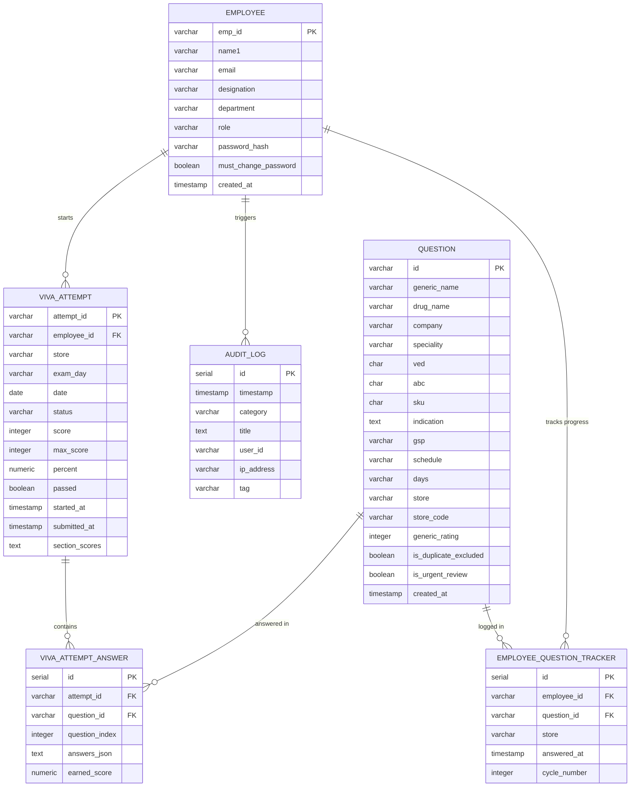

# PharmaQ Database Schema & Backend Guide

This document defines the complete database structure required to support the PharmaQ frontend application. It bridges the gap between the Flutter mobile client and the Python Flask backend, detailing existing tables and new tables needed to store attempts, track compliance, prevent question repetition, and log security audits.

---

## 1. Entity-Relationship (ER) Diagram

The following diagram illustrates the relationship between the key database tables:



---

## 2. Table Specifications

### 2.1. `employees`
Stores account and authentication credentials for all users (Employees, Mentors, Admins).
*   **Existing Database Status:** Already exists, but may need columns for role-based access control and password management.

| Column Name | Data Type | Constraints | Description |
| :--- | :--- | :--- | :--- |
| `emp_id` | `VARCHAR(50)` | Primary Key | Unique employee ID (e.g. `employee`, `mentor`, `admin123`). |
| `name1` | `VARCHAR(100)` | NOT NULL | Employee's full name. |
| `email` | `VARCHAR(150)` | UNIQUE, NOT NULL | Corporate email address. |
| `designation` | `VARCHAR(100)` | | Designation (e.g. `Staff Pharmacist`, `Clinical Mentor`). |
| `department` | `VARCHAR(100)` | | Department/Work area (e.g. `Inpatient Pharmacy`). |
| `role` | `VARCHAR(20)` | NOT NULL, Default: `'Employee'` | Role permissions: `'Employee'`, `'Mentor'`, or `'Admin'`. |
| `password_hash` | `VARCHAR(255)` | NOT NULL | Secure salted password hash (e.g., bcrypt). |
| `must_change_password` | `BOOLEAN` | Default: `FALSE` | Forced password reset flag on first login. |
| `created_at` | `TIMESTAMP` | Default: `CURRENT_TIMESTAMP` | Date and time the account was created. |
| `updated_at` | `TIMESTAMP` | Default: `CURRENT_TIMESTAMP` | Date and time of the last update. |

---

### 2.2. `questions`
Stores the drug database, clinical guidelines, classification parameters, and questions.
*   **Existing Database Status:** Already exists, but needs columns for editor options.

| Column Name | Data Type | Constraints | Description |
| :--- | :--- | :--- | :--- |
| `id` | `VARCHAR(50)` | Primary Key | Unique question ID (e.g. `q1`, `q2`). |
| `generic_name` | `VARCHAR(255)` | NOT NULL | Generic name of drug in uppercase (e.g., `AMOXICILLIN`). |
| `drug_name` | `VARCHAR(255)` | NOT NULL | Associated brand name (e.g., `Amoxil`). |
| `company` | `VARCHAR(255)` | | Manufacturer/Company (e.g. `GlaxoSmithKline`). |
| `speciality` | `VARCHAR(255)` | | Department specialty (e.g. `Infectious Diseases`). |
| `ved` | `CHAR(1)` | NOT NULL | VED category: `'V'` (Vital), `'E'` (Essential), `'D'` (Desirable). |
| `abc` | `CHAR(1)` | NOT NULL | ABC category: `'A'`, `'B'`, `'C'`. |
| `sku` | `CHAR(1)` | NOT NULL | SKU status: `'Y'` (Yes), `'N'` (No). |
| `indication` | `TEXT` | | Primary clinical indication and instructions. |
| `gsp` | `VARCHAR(255)` | NOT NULL | Generic Strength Pattern (e.g. `AMOXICILLIN(500 mg)Capsule`). |
| `schedule` | `VARCHAR(20)` | NOT NULL | Schedule Category (e.g. `Rx`, `OTC`, `H`). |
| `days` | `VARCHAR(20)` | | Study time period indicator (e.g. `Day 001`, `Day 005`). |
| `store` | `VARCHAR(100)` | | Associated store name (e.g., `Main Pharmacy A`). |
| `store_code` | `VARCHAR(20)` | | Associated store identifier code (e.g. `101`). |
| `generic_rating` | `INTEGER` | | Cognitive load score (e.g., `100` for Easy, `180` for Medium, `250` for Hard). |
| `is_duplicate_excluded` | `BOOLEAN` | Default: `FALSE` | Flags if duplicate checks should be bypassed. |
| `is_urgent_review` | `BOOLEAN` | Default: `FALSE` | Flags if a senior verification is required. |
| `created_at` | `TIMESTAMP` | Default: `CURRENT_TIMESTAMP` | Log date of creation. |

---

### 2.3. `viva_attempts` (New Table)
Logs all exam/viva sessions. When an employee starts an assessment, a record is created here.
*   **Purpose:** Track active assessments, save statistics, and record overall score compliance.

| Column Name | Data Type | Constraints | Description |
| :--- | :--- | :--- | :--- |
| `attempt_id` | `VARCHAR(50)` | Primary Key | Unique ID generated by frontend (e.g., `ATT8f2b1c...`) or UUID. |
| `employee_id` | `VARCHAR(50)` | FK to `employees(emp_id)` | The ID of the employee taking the exam. |
| `store` | `VARCHAR(100)` | NOT NULL | Store scope of the exam. |
| `exam_day` | `VARCHAR(20)` | NOT NULL | Day code (e.g., `Day 001`). |
| `date` | `DATE` | NOT NULL | Date of the exam (YYYY-MM-DD). |
| `status` | `VARCHAR(20)` | NOT NULL | Attempt status: `'Started'`, `'Completed'`, `'Aborted'`. |
| `score` | `INTEGER` | Default: `0` | Summed score details (typically out of 100). |
| `max_score` | `INTEGER` | Default: `100` | Maximum possible score. |
| `percent` | `NUMERIC(5,2)` | Default: `0.00` | Percentage score achieved (0.00 to 100.00). |
| `passed` | `BOOLEAN` | Default: `FALSE` | Passed flag (`score >= 70%`). |
| `started_at` | `TIMESTAMP` | NOT NULL | Absolute start time. |
| `submitted_at` | `TIMESTAMP` | | Time of exam submission. |
| `section_scores` | `TEXT` | | JSON string representing category details (e.g. `{"Accuracy": 85}`). |

---

### 2.4. `viva_attempt_answers` (New Table)
Stores detailed user submissions for individual questions during an attempt.
*   **Purpose:** Supports "Save and Resume" by restoring the employee's state, and allows mentors to review exactly what the employee answered.

| Column Name | Data Type | Constraints | Description |
| :--- | :--- | :--- | :--- |
| `id` | `SERIAL` (INT) | Primary Key | Auto-incrementing identifier. |
| `attempt_id` | `VARCHAR(50)` | FK to `viva_attempts` | Reference to the parent attempt. |
| `question_id` | `VARCHAR(50)` | FK to `questions` | Reference to the question answered. |
| `question_index` | `INTEGER` | NOT NULL | Index of the question in the quiz list (0-based). |
| `answers_json` | `TEXT` / `JSON` | NOT NULL | The user's submitted values (e.g., brand_name, strength, rationales, etc.). |
| `earned_score` | `NUMERIC(5,2)` | Default: `0.00` | Score points earned for this single question (0.0 to 100.0). |

---

### 2.5. `employee_question_tracker` (New Table)
Records every question successfully completed by an employee to prevent repetitions.
*   **Purpose:** Ensures questions do not repeat for an employee within a specific store/counter until they complete the entire question cycle.

| Column Name | Data Type | Constraints | Description |
| :--- | :--- | :--- | :--- |
| `id` | `SERIAL` (INT) | Primary Key | Auto-incrementing identifier. |
| `employee_id` | `VARCHAR(50)` | FK to `employees` | The employee. |
| `question_id` | `VARCHAR(50)` | FK to `questions` | The answered question. |
| `store` | `VARCHAR(100)` | NOT NULL | Pharmacy store/counter constraint (e.g., `Main Pharmacy A`). |
| `answered_at` | `TIMESTAMP` | Default: `CURRENT_TIMESTAMP` | Date and time the question was completed. |
| `cycle_number` | `INTEGER` | Default: `1` | Tracker cycle. Increments when all questions in a counter are completed. |

---

### 2.6. `audit_logs` (New Table)
Logs security events, role updates, data purges, and system events.
*   **Purpose:** Populates the Admin Audit Logs Screen.

| Column Name | Data Type | Constraints | Description |
| :--- | :--- | :--- | :--- |
| `id` | `SERIAL` (INT) | Primary Key | Auto-incrementing identifier. |
| `timestamp` | `TIMESTAMP` | Default: `CURRENT_TIMESTAMP` | Action time. |
| `category` | `VARCHAR(50)` | NOT NULL | Event classification (e.g., `SECURITY ALERT`, `ROLE MODIFIED`). |
| `title` | `TEXT` | NOT NULL | Detailed action log string. |
| `user_id` | `VARCHAR(50)` | | User who triggered the log (can be null for system actions). |
| `ip_address` | `VARCHAR(45)` | | Client IP address (v4 or v6). |
| `tag` | `VARCHAR(20)` | | Tag metadata (e.g. `Critical`, `Info`, `Modified`, `Deleted`). |

---

## 3. SQL DDL Bootstrapping Script (PostgreSQL/MySQL/SQLite)

Run this SQL script on your database to create the required tables and linkages.

```sql
-- 1. EMPLOYEES TABLE (If updating existing, add fields appropriately)
CREATE TABLE IF NOT EXISTS employees (
    emp_id VARCHAR(50) PRIMARY KEY,
    name1 VARCHAR(100) NOT NULL,
    email VARCHAR(150) UNIQUE NOT NULL,
    designation VARCHAR(100),
    department VARCHAR(100),
    role VARCHAR(20) NOT NULL DEFAULT 'Employee',
    password_hash VARCHAR(255) NOT NULL,
    must_change_password BOOLEAN DEFAULT FALSE,
    created_at TIMESTAMP DEFAULT CURRENT_TIMESTAMP,
    updated_at TIMESTAMP DEFAULT CURRENT_TIMESTAMP
);

-- 2. QUESTIONS TABLE (If updating existing, add/adjust fields)
CREATE TABLE IF NOT EXISTS questions (
    id VARCHAR(50) PRIMARY KEY,
    generic_name VARCHAR(255) NOT NULL,
    drug_name VARCHAR(255) NOT NULL,
    company VARCHAR(255),
    speciality VARCHAR(255),
    ved CHAR(1) NOT NULLCHECK (ved IN ('V', 'E', 'D')),
    abc CHAR(1) NOT NULL CHECK (abc IN ('A', 'B', 'C')),
    sku CHAR(1) NOT NULL CHECK (sku IN ('Y', 'N')),
    indication TEXT,
    gsp VARCHAR(255) NOT NULL,
    schedule VARCHAR(20) NOT NULL,
    days VARCHAR(20),
    store VARCHAR(100),
    store_code VARCHAR(20),
    generic_rating INTEGER,
    is_duplicate_excluded BOOLEAN DEFAULT FALSE,
    is_urgent_review BOOLEAN DEFAULT FALSE,
    created_at TIMESTAMP DEFAULT CURRENT_TIMESTAMP
);

-- 3. VIVA ATTEMPTS TABLE
CREATE TABLE IF NOT EXISTS viva_attempts (
    attempt_id VARCHAR(50) PRIMARY KEY,
    employee_id VARCHAR(50) NOT NULL,
    store VARCHAR(100) NOT NULL,
    exam_day VARCHAR(20) NOT NULL,
    date DATE NOT NULL,
    status VARCHAR(20) NOT NULL CHECK (status IN ('Started', 'Completed', 'Aborted')),
    score INTEGER DEFAULT 0,
    max_score INTEGER DEFAULT 100,
    percent NUMERIC(5,2) DEFAULT 0.00,
    passed BOOLEAN DEFAULT FALSE,
    started_at TIMESTAMP NOT NULL,
    submitted_at TIMESTAMP,
    section_scores TEXT, -- Stores JSON string
    FOREIGN KEY (employee_id) REFERENCES employees(emp_id) ON DELETE CASCADE
);

-- 4. VIVA ATTEMPT ANSWERS TABLE
CREATE TABLE IF NOT EXISTS viva_attempt_answers (
    id SERIAL PRIMARY KEY,
    attempt_id VARCHAR(50) NOT NULL,
    question_id VARCHAR(50) NOT NULL,
    question_index INTEGER NOT NULL,
    answers_json TEXT NOT NULL, -- Stores JSON answer map
    earned_score NUMERIC(5,2) DEFAULT 0.00,
    FOREIGN KEY (attempt_id) REFERENCES viva_attempts(attempt_id) ON DELETE CASCADE,
    FOREIGN KEY (question_id) REFERENCES questions(id) ON DELETE CASCADE
);

-- 5. EMPLOYEE QUESTION TRACKER (Non-repeating logic)
CREATE TABLE IF NOT EXISTS employee_question_tracker (
    id SERIAL PRIMARY KEY,
    employee_id VARCHAR(50) NOT NULL,
    question_id VARCHAR(50) NOT NULL,
    store VARCHAR(100) NOT NULL,
    answered_at TIMESTAMP DEFAULT CURRENT_TIMESTAMP,
    cycle_number INTEGER DEFAULT 1,
    FOREIGN KEY (employee_id) REFERENCES employees(emp_id) ON DELETE CASCADE,
    FOREIGN KEY (question_id) REFERENCES questions(id) ON DELETE CASCADE
);

-- 6. AUDIT LOGS TABLE
CREATE TABLE IF NOT EXISTS audit_logs (
    id SERIAL PRIMARY KEY,
    timestamp TIMESTAMP DEFAULT CURRENT_TIMESTAMP,
    category VARCHAR(50) NOT NULL,
    title TEXT NOT NULL,
    user_id VARCHAR(50),
    ip_address VARCHAR(45),
    tag VARCHAR(20)
);

-- Create indexes for compliance and lookup speed
CREATE INDEX IF NOT EXISTS idx_tracker_emp_store ON employee_question_tracker(employee_id, store);
CREATE INDEX IF NOT EXISTS idx_attempts_emp ON viva_attempts(employee_id);
```

---

## 4. Flask SQLAlchemy Models (Python)

Copy and paste this code directly into your Flask backend codebase (e.g. `models.py`) to build the database mapping using SQLAlchemy.

```python
from flask_sqlalchemy import SQLAlchemy
from datetime import datetime
import json

db = SQLAlchemy()

class Employee(db.Model):
    __tablename__ = 'employees'
    
    emp_id = db.Column(db.String(50), primary_key=True)
    name1 = db.Column(db.String(100), nullable=False)
    email = db.Column(db.String(150), unique=True, nullable=False)
    designation = db.Column(db.String(100))
    department = db.Column(db.String(100))
    role = db.Column(db.String(20), nullable=False, default='Employee')
    password_hash = db.Column(db.String(255), nullable=False)
    must_change_password = db.Column(db.Boolean, default=False)
    created_at = db.Column(db.DateTime, default=datetime.utcnow)
    updated_at = db.Column(db.DateTime, default=datetime.utcnow, onupdate=datetime.utcnow)

    attempts = db.relationship('VivaAttempt', backref='employee', lazy=True, cascade="all, delete-orphan")
    tracked_questions = db.relationship('EmployeeQuestionTracker', backref='employee', lazy=True, cascade="all, delete-orphan")


class Question(db.Model):
    __tablename__ = 'questions'
    
    id = db.Column(db.String(50), primary_key=True)
    generic_name = db.Column(db.String(255), nullable=False)
    drug_name = db.Column(db.String(255), nullable=False)
    company = db.Column(db.String(255))
    speciality = db.Column(db.String(255))
    ved = db.Column(db.String(1), nullable=False)
    abc = db.Column(db.String(1), nullable=False)
    sku = db.Column(db.String(1), nullable=False)
    indication = db.Column(db.Text)
    gsp = db.Column(db.String(255), nullable=False)
    schedule = db.Column(db.String(20), nullable=False)
    days = db.Column(db.String(20))
    store = db.Column(db.String(100))
    store_code = db.Column(db.String(20))
    generic_rating = db.Column(db.Integer)
    is_duplicate_excluded = db.Column(db.Boolean, default=False)
    is_urgent_review = db.Column(db.Boolean, default=False)
    created_at = db.Column(db.DateTime, default=datetime.utcnow)

    answers = db.relationship('VivaAttemptAnswer', backref='question', lazy=True)
    trackers = db.relationship('EmployeeQuestionTracker', backref='question', lazy=True)


class VivaAttempt(db.Model):
    __tablename__ = 'viva_attempts'
    
    attempt_id = db.Column(db.String(50), primary_key=True)
    employee_id = db.Column(db.String(50), db.ForeignKey('employees.emp_id'), nullable=False)
    store = db.Column(db.String(100), nullable=False)
    exam_day = db.Column(db.String(20), nullable=False)
    date = db.Column(db.Date, nullable=False)
    status = db.Column(db.String(20), nullable=False, default='Started')
    score = db.Column(db.Integer, default=0)
    max_score = db.Column(db.Integer, default=100)
    percent = db.Column(db.Numeric(5, 2), default=0.00)
    passed = db.Column(db.Boolean, default=False)
    started_at = db.Column(db.DateTime, nullable=False, default=datetime.utcnow)
    submitted_at = db.Column(db.DateTime)
    section_scores = db.Column(db.Text) # Stores serialized JSON string

    answers = db.relationship('VivaAttemptAnswer', backref='attempt', lazy=True, cascade="all, delete-orphan")

    def set_section_scores(self, data):
        self.section_scores = json.dumps(data)

    def get_section_scores(self):
        return json.loads(self.section_scores) if self.section_scores else {}


class VivaAttemptAnswer(db.Model):
    __tablename__ = 'viva_attempt_answers'
    
    id = db.Column(db.Integer, primary_key=True, autoincrement=True)
    attempt_id = db.Column(db.String(50), db.ForeignKey('viva_attempts.attempt_id'), nullable=False)
    question_id = db.Column(db.String(50), db.ForeignKey('questions.id'), nullable=False)
    question_index = db.Column(db.Integer, nullable=False)
    answers_json = db.Column(db.Text, nullable=False) # Stores response dictionary as JSON string
    earned_score = db.Column(db.Numeric(5, 2), default=0.00)

    def set_answers(self, data):
        self.answers_json = json.dumps(data)

    def get_answers(self):
        return json.loads(self.answers_json) if self.answers_json else {}


class EmployeeQuestionTracker(db.Model):
    __tablename__ = 'employee_question_tracker'
    
    id = db.Column(db.Integer, primary_key=True, autoincrement=True)
    employee_id = db.Column(db.String(50), db.ForeignKey('employees.emp_id'), nullable=False)
    question_id = db.Column(db.String(50), db.ForeignKey('questions.id'), nullable=False)
    store = db.Column(db.String(100), nullable=False)
    answered_at = db.Column(db.DateTime, default=datetime.utcnow)
    cycle_number = db.Column(db.Integer, default=1)


class AuditLog(db.Model):
    __tablename__ = 'audit_logs'
    
    id = db.Column(db.Integer, primary_key=True, autoincrement=True)
    timestamp = db.Column(db.DateTime, default=datetime.utcnow)
    category = db.Column(db.String(50), nullable=False)
    title = db.Column(db.Text, nullable=False)
    user_id = db.Column(db.String(50))
    ip_address = db.Column(db.String(45))
    tag = db.Column(db.String(20))
```

---

## 5. API Routes to DB Action Mapping

These descriptions outline exactly which Flask URL endpoints the Flutter client calls and the specific database actions they trigger.

### 5.1. Authentication (`/api/method/emp_auth_api`)
Handles logins, password resets, and changes.

*   **Action: `login`** (POST)
    *   **Payload:** `{"employee_id": "...", "password": "..."}`
    *   **Logic:** Look up the record in `employees` where `emp_id = employee_id`. Retrieve the `password_hash`. Verify the passwords match.
    *   **Response:** `{"status": "Success", "employee_id": "...", "name": "...", "role": "...", "force_password_change": boolean}`.

*   **Action: `init`** (POST)
    *   **Payload:** `{"employee_id": "..."}`
    *   **Logic:** Find the user in `employees`, set their password to a default starting value, and mark `must_change_password = True`.

*   **Action: `change_password`** (POST)
    *   **Payload:** `{"employee_id": "...", "new_password": "..."}`
    *   **Logic:** Hash the `new_password` and update `password_hash`. Set `must_change_password = False`.

---

### 5.2. Employee Management (`/api/method/employee_master_api`)
CRUD operations for managers/admins.

*   **Action: Fetch Directory** (GET)
    *   **Logic:** Query and return all employees. E.g., `db.session.query(Employee).all()`.
*   **Action: `create`** (POST)
    *   **Payload:** JSON representation of employee details.
    *   **Logic:** Insert a new row into `employees` (hash default password).
*   **Action: `update`** (POST)
    *   **Payload:** JSON of updated employee details.
    *   **Logic:** Query by `emp_id` and update fields like `designation`, `role`, or `department`.
*   **Action: `delete`** (POST)
    *   **Payload:** `{"emp_id": "..."}`
    *   **Logic:** Delete the employee profile. (Cascade rules will clean up attempts and trackers).

---

### 5.3. Question Management (`/api/method/questions_master_api`)
CRUD operations for study drugs and examination queries.

*   **Action: Fetch Questions** (GET)
    *   **Query Parameters:** `store`, `speciality`, `days`, `search` (all optional).
    *   **Logic:** Filter questions dynamically. E.g.,
        *   If `store` is provided, filter: `questions.store = store`
        *   If `days` is provided, filter: `questions.days = days`
        *   If `search` is provided, search in `generic_name` or `drug_name`.
    *   **Integration Tip (Non-Repeating):** When an **employee** requests questions for a Viva, the backend should subtract already completed questions for this employee and store from the returned set. *(See Section 6).*
*   **Action: `create` / `update` / `delete`** (POST)
    *   **Logic:** Standard database operations for questions.

---

### 5.4. Attempt Logging (`/api/method/attempt_master_api`)
Logs exam session lifecycles.

*   **Action: Fetch Attempts** (GET)
    *   **Query Parameters:** `employee_id` (optional).
    *   **Logic:** If `employee_id` is supplied, filter attempts for that employee. Otherwise, return all attempts (used for Mentor/Admin dashboards).
*   **Action: `create`** (POST)
    *   **Payload:**
        ```json
        {
          "attempt_id": "ATT82f0bc...",
          "employee_id": "emp01",
          "store": "Main Pharmacy A",
          "exam_day": "Day 001",
          "date": "2026-06-15",
          "status": "Started" or "Completed",
          "score": 85,
          "max_score": 100,
          "percent": 85.0,
          "passed": 1,
          "started_at": "2026-06-15 17:00:00",
          "submitted_at": "2026-06-15 17:15:00",
          "section_scores": "{\"Accuracy\": 85}"
        }
        ```
    *   **Logic:** Update or insert the attempt. When `status` is `'Completed'`:
        1.  Save the attempt summary.
        2.  Insert matching records into `employee_question_tracker` for all the question IDs included in this attempt so they are marked as answered.

---

### 5.5. Statistics (`/api/method/dashboard_stats_api`)
Serves Bento grid dashboard values.

*   **Request:** GET `/api/method/dashboard_stats_api?employee_id=emp01`
*   **Logic:** Query completed attempts for `employee_id`:
    *   `exams_attended` = Count of attempts where `status = 'Completed'`.
    *   `avg_mark` = Average value of `percent`.
    *   `accuracy_rate` = (Count of attempts where `passed = True` / `exams_attended`) * 100.
*   **Response:**
    ```json
    {
      "exams_attended": 12,
      "avg_mark": 82.5,
      "completed_count": 12,
      "accuracy_rate": 91.6
    }
    ```

---

## 6. Business Logic Implementations in DB

### 6.1. Non-Repeating Questions & Tracker Cycle Resets
The product requirements require non-repeating questions per employee and counter (store). Here is the backend logic flow:

1.  **Retrieve Available Questions:** Find all questions matching the target filters (e.g. `store = 'Main Pharmacy A'`).
2.  **Retrieve Completed Questions:** Search `employee_question_tracker` for the requesting employee and store.
    *   Get the current `cycle_number` for this employee/store (defaults to `1` if empty).
    *   Find all `question_id`s already recorded under this `cycle_number`.
3.  **Perform Set Subtraction:** Remove the completed questions from the available pool.
4.  **Auto-Reset Cycle:** If the subtracted pool is empty (or smaller than the requested exam question count):
    *   All questions in this counter have been completed!
    *   Increment the `cycle_number` in the database for this employee and store.
    *   The completed question list for the new cycle is now empty. Return all questions from this counter (resets the cycle).

### 6.2. Weekly Compliance (150 Questions)
To track weekly compliance:
*   Calculate the date boundary for the current week (e.g., Monday 00:00:00 to Sunday 23:59:59).
*   Sum the question counts from all completed attempts in `viva_attempts` for that employee within the date boundary.
*   Compare the sum to the 150-question compliance threshold to flag status as:
    *   **Compliant:** $\ge 150$ questions.
    *   **At Risk:** $100 \text{ to } 149$ questions.
    *   **Non-Compliant:** $< 100$ questions.

### 6.3. Easy Mode Duplicate Prevention
In Easy Mode, the frontend ensures that no questions share the same `generic_name`.
*   If filtering questions on the backend, group or select unique `generic_name` values before returning questions, unless `is_duplicate_excluded` is checked.
